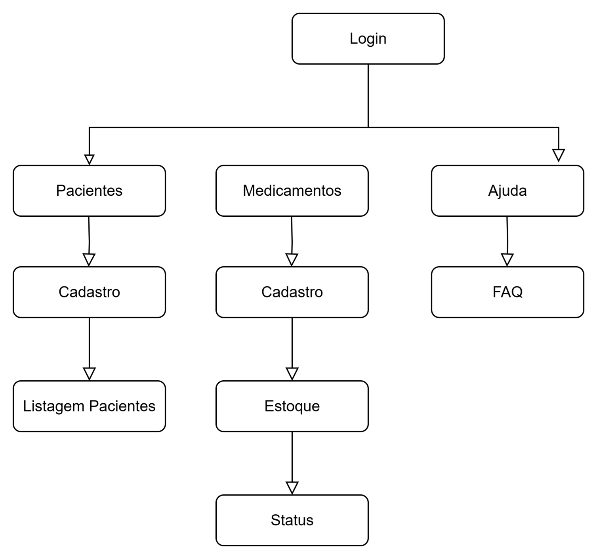
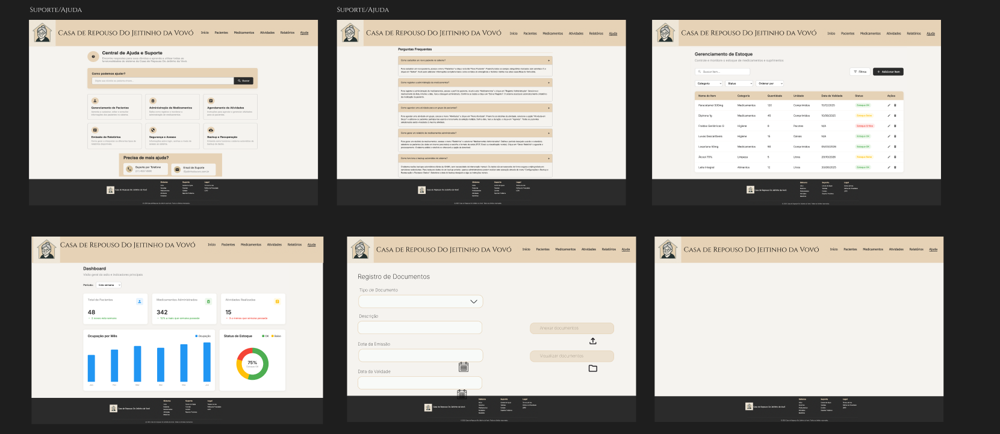
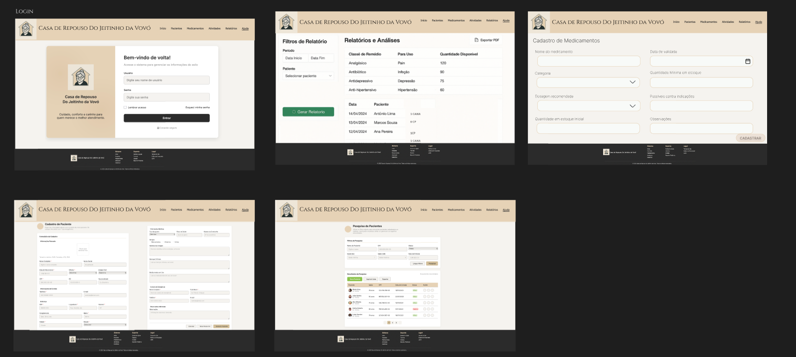
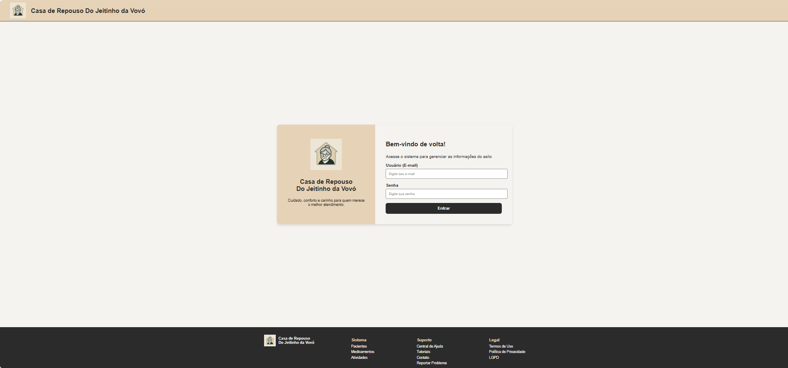
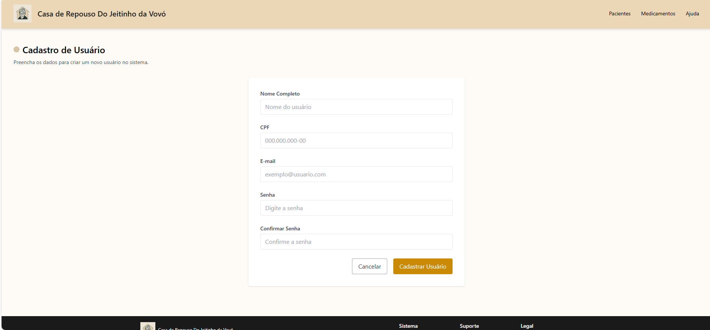
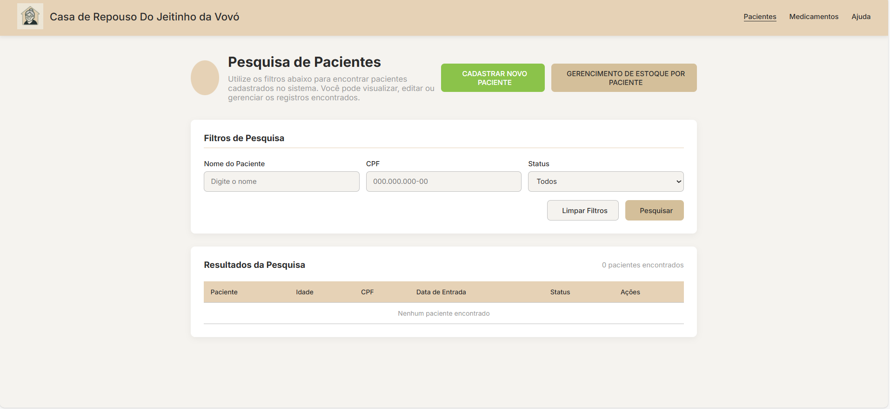
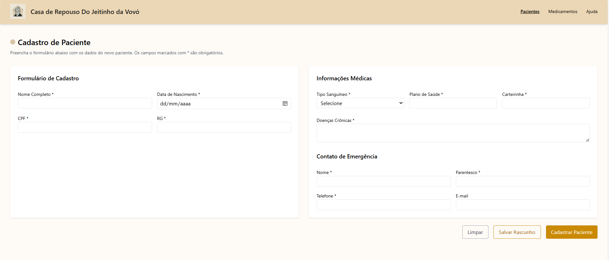
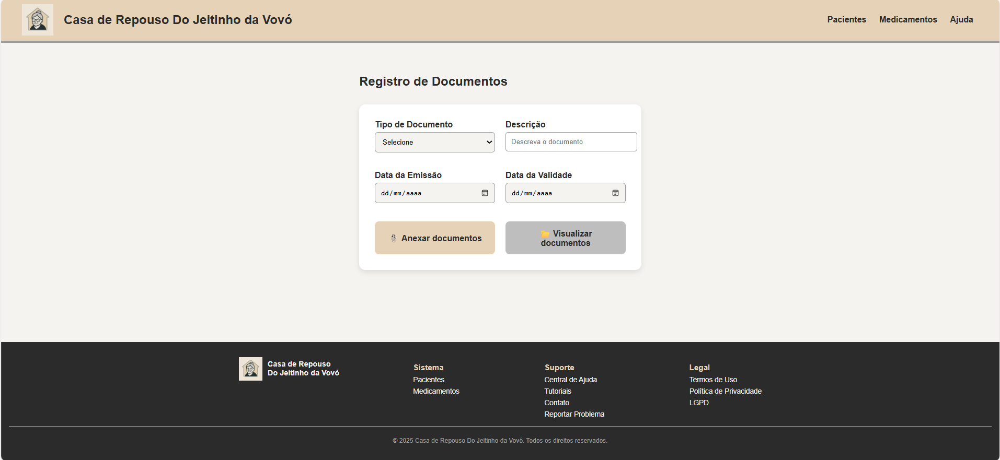
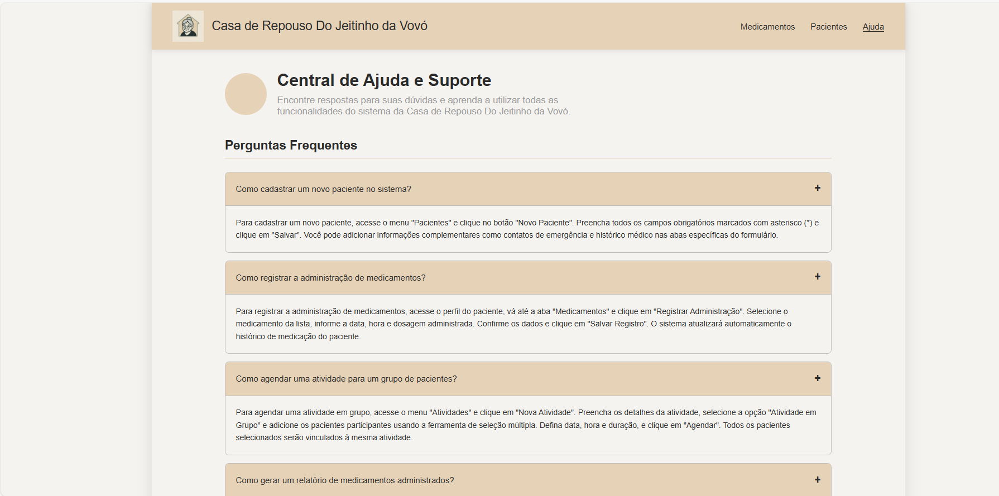

# Projeto de interface

A seguir, apresentamos uma visão geral das telas desenvolvidas para o sistema, com base nos requisitos funcionais e não funcionais descritos na Especificação do Projeto. As telas foram elaboradas no Figma, com atenção à usabilidade, fluidez na navegação e clareza das ações para o usuário.

🔗 Link para o protótipo interativo:
Figma - Protótipo de Interface do Sistema
 ## User flow

O fluxo de navegação foi projetado para guiar o usuário de maneira intuitiva pelas principais funcionalidades da aplicação. Desde o login até a realização de ações específicas (como cadastrar, editar ou visualizar informações), o objetivo é reduzir o número de cliques e manter a consistência visual.

### Diagrama de fluxo

## Wireframes

As telas foram desenhadas com base em wireframes de média-alta fidelidade, com atenção à usabilidade, clareza de informações e acessibilidade. A identidade visual segue uma paleta de tons neutros e ícones representativos que favorecem o público idoso e cuidadores.

 

## Interface do sistema

A plataforma da “Casa de Repouso Do Jeitinho da Vovó” oferece um sistema integrado de gestão para pacientes, medicamentos, atividades, relatórios e suporte. A navegação é clara, com um menu superior persistente que facilita o acesso a todas as funcionalidades principais.

### Tela Login
Permite que o usuário (funcionário do sistema) acesse o sistema com suas credenciais.

### Tela Cadastro Usuário
Permite que um novo usuário (como um funcionário, cuidador ou administrador) seja registrado no sistema com suas informações básicas. Mas somente o administrador pode realizar este Cadastro.

### Tela Pacientes
Permite pesquisar, visualizar, cadastrar ou editar pacientes já registrados no sistema.

### Tela Cadastro Pacientes
A tela permite o registro completo dos dados do paciente, informações de contato do responsável e informações adicionais de saúde.

### Tela Registro de Documentos
Tela que permite anexar documentos como exames, laudos e receitas, com campos para tipo, data de emissão e validade.

### Tela Gerenciamento de Estoque
Permite monitorar, adicionar, editar e excluir os medicamentos de cada paciente, além de acompanhar o nível de estoque.

### Tela Ajuda
É uma página de perguntas frequentes (FAQ) para auxiliar os usuários com dúvidas comuns.

