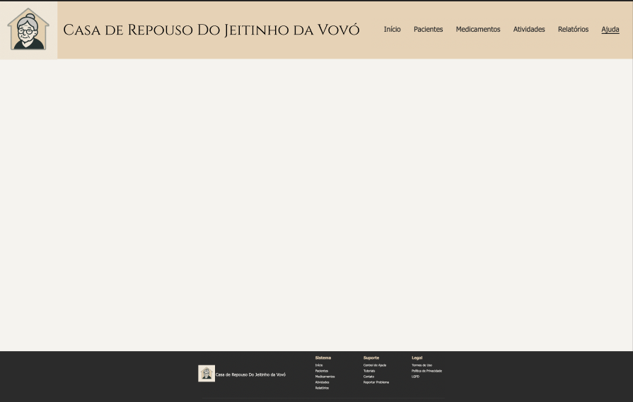

# Template padrão da aplicação

A aplicação segue um layout padronizado e coeso, desenvolvido no Figma, visando garantir uma experiência de usuário (UX) consistente, responsiva e agradável em todas as páginas.

 **Paleta de Cores**
A identidade visual foi definida a partir de cores que transmitem confiança, simplicidade e acessibilidade. A paleta inclui:

Bege Claro (fundo da casa): #E6D2B6

Cinza Claro (cabelo da vovó): #BEBEBE

Preto Suave (traços e roupa): #2B2B2B

Branco Suave (rosto e fundo): #F5F3EF

Cinza Médio (contorno da casa): #9C9C9C

**Logotipo e Elementos Visuais**
O logotipo foi projetado para ser minimalista e simbólico, utilizando formas geométricas simples e fontes legíveis.
Significado:

As formas e cores transmitem inovação, colaboração e objetividade. O nome da aplicação está em destaque, com uma tipografia moderna, para reforçar a marca.

* Elementos visuais adicionais:

Ícones circulares com traços finos.

Botões com cantos arredondados e sombra suave.

Áreas bem espaçadas para facilitar a navegação.
